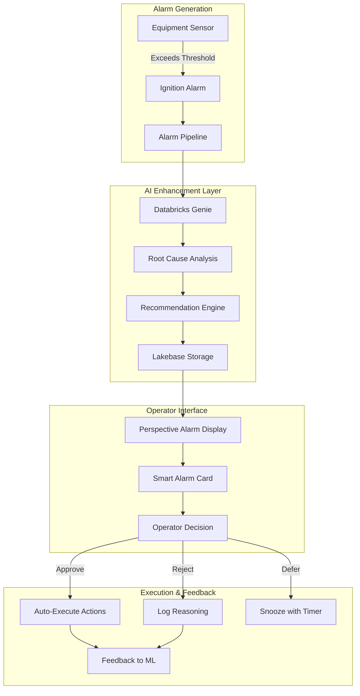

# 🚨 Alarm Operator Recommendation Workflow in Perspective

## Overview

This document describes how AI-powered recommendations are integrated with Ignition's alarm system to provide intelligent operator guidance.

## Workflow Architecture



## 1. Alarm Enhancement Pipeline

### 1.1 Standard Alarm Triggers AI Analysis

```python
# Gateway Event Script - Alarm Active
def onAlarmActive(alarmEvent):
    """
    When alarm becomes active, trigger AI analysis
    """

    # Extract alarm details
    alarm_data = {
        "name": alarmEvent.name,
        "source": alarmEvent.source,
        "priority": alarmEvent.priority,
        "value": alarmEvent.value,
        "setpoint": alarmEvent.setpointA,
        "label": alarmEvent.label,
        "timestamp": alarmEvent.activeTime
    }

    # Only process high/critical alarms for AI analysis
    if alarmEvent.priority >= 2:  # High or Critical

        # Get equipment context
        equipment_id = extract_equipment_id(alarmEvent.source)

        # Query recent sensor history
        history = get_sensor_history(equipment_id, minutes=60)

        # Get enriched context (CMMS, MES, etc.)
        context = get_enterprise_context(equipment_id)

        # Send to Databricks for AI analysis
        recommendation = call_databricks_genie(
            alarm_data,
            history,
            context
        )

        # Store in Lakebase for operator review
        store_recommendation(recommendation, alarmEvent.id)

        # Update alarm with AI insights
        system.alarm.updateAlarm(
            alarmEvent.id,
            notes=f"AI Analysis: {recommendation['summary']}",
            customProperties={
                "ai_confidence": recommendation['confidence'],
                "recommended_action": recommendation['action'],
                "root_cause": recommendation['root_cause']
            }
        )
```

### 1.2 Databricks Genie Analysis

```python
def call_databricks_genie(alarm, history, context):
    """
    Send to Databricks for intelligent analysis
    """

    prompt = f"""
    ALARM ANALYSIS REQUEST:

    CURRENT ALARM:
    - Equipment: {alarm['source']}
    - Alarm: {alarm['label']}
    - Value: {alarm['value']} (Setpoint: {alarm['setpoint']})
    - Priority: {alarm['priority']}

    RECENT HISTORY (Last Hour):
    {format_sensor_history(history)}

    ENTERPRISE CONTEXT:
    - Production Status: {context['mes']['production_priority']}
    - Last Maintenance: {context['cmms']['days_since_maintenance']} days
    - Similar Alarms: {context['historical']['similar_count']} in past week
    - Current Weather: {context['weather']['temperature']}°C
    - Parts Available: {context['erp']['critical_parts_in_stock']}

    PROVIDE:
    1. Root cause analysis (with confidence %)
    2. Recommended immediate action
    3. Step-by-step resolution procedure
    4. Expected resolution time
    5. Consequences if ignored
    6. Alternative actions if primary not feasible
    """

    response = databricks_client.query_genie(prompt)

    return {
        "alarm_id": alarm['id'],
        "root_cause": response['root_cause'],
        "confidence": response['confidence'],
        "action": response['recommended_action'],
        "procedure": response['steps'],
        "urgency": response['urgency'],
        "consequences": response['consequences'],
        "alternatives": response['alternatives'],
        "estimated_time": response['resolution_time']
    }
```

## 2. Perspective Alarm Display Components

### 2.1 Smart Alarm Banner

```json
{
  "type": "SmartAlarmBanner",
  "position": {
    "x": 0,
    "y": 0,
    "width": "100%",
    "height": 120
  },
  "props": {
    "style": {
      "backgroundColor": "#FF3621",
      "animation": "pulse 2s infinite"
    }
  },
  "custom": {
    "showAIRecommendations": true,
    "autoRotate": true,
    "rotationInterval": 5000
  },
  "children": [
    {
      "type": "AlarmSummaryCard",
      "props": {
        "alarm": "{activeAlarm}",
        "showRecommendation": true
      }
    }
  ]
}
```

### 2.2 Intelligent Alarm Card Component

```python
# Perspective Component Script
class IntelligentAlarmCard:

    def __init__(self, alarm_id):
        self.alarm_id = alarm_id
        self.recommendation = None
        self.load_recommendation()

    def load_recommendation(self):
        """Load AI recommendation from Lakebase"""
        query = """
            SELECT * FROM lakebase.agentic_hmi.alarm_recommendations
            WHERE alarm_id = ? AND status = 'pending'
        """
        self.recommendation = system.db.runPrepQuery(
            query, [self.alarm_id], "Lakebase"
        )[0]

    def render(self):
        """Render the alarm card with AI insights"""
        return {
            "type": "flex",
            "direction": "column",
            "children": [
                # Alarm header with severity
                {
                    "type": "AlarmHeader",
                    "severity": self.alarm.priority,
                    "equipment": self.alarm.source,
                    "timestamp": self.alarm.activeTime
                },

                # AI Analysis Section
                {
                    "type": "AIAnalysis",
                    "confidence": self.recommendation['confidence'],
                    "rootCause": self.recommendation['root_cause'],
                    "showConfidenceBar": True
                },

                # Recommended Action
                {
                    "type": "RecommendedAction",
                    "action": self.recommendation['action'],
                    "estimatedTime": self.recommendation['estimated_time'],
                    "urgency": self.recommendation['urgency']
                },

                # Action Buttons
                {
                    "type": "ActionButtons",
                    "buttons": [
                        {"label": "EXECUTE", "action": "approve", "style": "primary"},
                        {"label": "DEFER", "action": "defer", "style": "warning"},
                        {"label": "REJECT", "action": "reject", "style": "danger"},
                        {"label": "DETAILS", "action": "expand", "style": "info"}
                    ]
                }
            ]
        }
```

## 3. Operator Interaction Workflow

### 3.1 Alarm Presentation Priority

```python
def prioritize_alarms_for_display():
    """
    Sort alarms by business impact, not just priority
    """

    alarms = system.alarm.queryStatus(state=["ActiveUnacked"])

    # Enrich with AI scores
    for alarm in alarms:
        # Get AI recommendation if exists
        rec = get_recommendation(alarm.id)
        if rec:
            alarm.ai_score = (
                alarm.priority * 2 +  # Base priority weight
                rec['confidence'] * 3 +  # AI confidence weight
                rec['business_impact'] * 5  # Business impact weight
            )
        else:
            alarm.ai_score = alarm.priority

    # Sort by AI score
    return sorted(alarms, key=lambda x: x.ai_score, reverse=True)
```

### 3.2 Progressive Disclosure UI

```javascript
// Perspective View - Progressive Alarm Display
export function AlarmDisplay({ alarms }) {

    const [expandedAlarm, setExpandedAlarm] = useState(null);
    const [filterLevel, setFilterLevel] = useState('smart'); // smart, all, critical

    const renderAlarmCard = (alarm) => {
        const hasAI = alarm.recommendation !== null;

        return (
            <Card
                key={alarm.id}
                className={`alarm-card ${alarm.severity}`}
                onClick={() => setExpandedAlarm(alarm.id)}
            >
                {/* Level 1: Basic Alarm Info */}
                <div className="alarm-basic">
                    <Icon type={getAlarmIcon(alarm.priority)} />
                    <span className="equipment">{alarm.equipment}</span>
                    <span className="description">{alarm.label}</span>
                    <TimeAgo timestamp={alarm.timestamp} />
                </div>

                {/* Level 2: AI Summary (if available) */}
                {hasAI && (
                    <div className="ai-summary">
                        <AIBadge confidence={alarm.recommendation.confidence} />
                        <span className="root-cause">
                            {alarm.recommendation.root_cause_summary}
                        </span>
                        <ActionPreview action={alarm.recommendation.action} />
                    </div>
                )}

                {/* Level 3: Expanded Details */}
                {expandedAlarm === alarm.id && (
                    <AlarmDetailsPanel
                        alarm={alarm}
                        recommendation={alarm.recommendation}
                        onAction={handleOperatorAction}
                    />
                )}
            </Card>
        );
    };

    return (
        <div className="alarm-display">
            {/* Filter Controls */}
            <FilterBar>
                <Toggle
                    label="Smart Priority"
                    checked={filterLevel === 'smart'}
                    onChange={() => setFilterLevel('smart')}
                />
                <Badge count={alarms.filter(a => a.hasAI).length} />
            </FilterBar>

            {/* Alarm List */}
            <div className="alarm-list">
                {prioritizeAlarms(alarms, filterLevel).map(renderAlarmCard)}
            </div>
        </div>
    );
}
```

## 4. Operator Action Execution

### 4.1 Automated Action Execution

```python
def execute_approved_action(alarm_id, recommendation_id, operator_id):
    """
    Execute the approved recommendation automatically
    """

    # Get the recommendation details
    rec = get_recommendation(recommendation_id)

    # Parse the action into executable steps
    steps = parse_action_steps(rec['procedure'])

    execution_log = []

    for step in steps:
        try:
            if step['type'] == 'write_tag':
                # Write to OPC tag
                system.tag.writeBlocking(
                    [step['tag_path']],
                    [step['value']]
                )
                execution_log.append(f"✓ Set {step['tag_path']} to {step['value']}")

            elif step['type'] == 'acknowledge_alarm':
                # Acknowledge the alarm
                system.alarm.acknowledge(
                    [alarm_id],
                    f"AI recommendation approved by {operator_id}"
                )
                execution_log.append("✓ Alarm acknowledged")

            elif step['type'] == 'create_work_order':
                # Create maintenance work order
                wo_number = create_cmms_work_order(
                    equipment_id=rec['equipment_id'],
                    issue=rec['root_cause'],
                    priority=rec['urgency']
                )
                execution_log.append(f"✓ Work order {wo_number} created")

            elif step['type'] == 'notify':
                # Send notifications
                system.alarm.sendMessage(
                    step['recipients'],
                    step['message'],
                    priority=step['priority']
                )
                execution_log.append(f"✓ Notified {len(step['recipients'])} users")

        except Exception as e:
            execution_log.append(f"✗ Failed: {step['description']} - {str(e)}")
            # Rollback if critical step fails
            if step.get('critical', False):
                rollback_actions(execution_log)
                raise

    # Update recommendation status
    update_recommendation_status(
        recommendation_id,
        status='executed',
        execution_log=execution_log,
        operator_id=operator_id
    )

    return execution_log
```

### 4.2 Operator Decision Tracking

```python
def track_operator_decision(alarm_id, decision, operator_id, reason=None):
    """
    Track all operator decisions for ML feedback
    """

    # Log to database
    query = """
        INSERT INTO operator_decisions (
            alarm_id,
            operator_id,
            decision,
            reason,
            recommendation_available,
            recommendation_followed,
            timestamp
        ) VALUES (?, ?, ?, ?, ?, ?, CURRENT_TIMESTAMP)
    """

    rec = get_recommendation_for_alarm(alarm_id)

    system.db.runPrepUpdate(query, [
        alarm_id,
        operator_id,
        decision,  # 'approve', 'reject', 'defer', 'manual'
        reason,
        rec is not None,
        decision == 'approve' if rec else False,
        system.date.now()
    ])

    # Send to ML pipeline for model improvement
    if rec:
        send_feedback_to_ml(
            recommendation_id=rec['id'],
            operator_decision=decision,
            operator_reason=reason
        )
```

## 5. Advanced UI Components

### 5.1 Confidence Visualization

```python
# Custom Perspective component for confidence display
def render_confidence_indicator(confidence):
    """
    Visual confidence indicator with explanation
    """
    return {
        "type": "flex-row",
        "children": [
            # Circular progress indicator
            {
                "type": "progress-circular",
                "value": confidence,
                "size": 60,
                "strokeWidth": 8,
                "color": get_confidence_color(confidence)
            },
            # Confidence explanation
            {
                "type": "text",
                "value": get_confidence_explanation(confidence),
                "style": {"marginLeft": 10}
            }
        ]
    }

def get_confidence_color(confidence):
    if confidence >= 0.8:
        return "#00A8E1"  # Cyan - High confidence
    elif confidence >= 0.6:
        return "#FFA500"  # Orange - Medium
    else:
        return "#FF3621"  # Red - Low

def get_confidence_explanation(confidence):
    if confidence >= 0.9:
        return "Very high confidence - Similar pattern seen 50+ times"
    elif confidence >= 0.8:
        return "High confidence - Matches historical patterns"
    elif confidence >= 0.6:
        return "Moderate confidence - Some uncertainty in diagnosis"
    else:
        return "Low confidence - Limited historical data"
```

### 5.2 Step-by-Step Procedure Guide

```javascript
// Interactive procedure component
class ProcedureGuide extends Component {

    state = {
        currentStep: 0,
        completedSteps: [],
        notes: {}
    };

    renderStep(step, index) {
        const { currentStep, completedSteps } = this.state;
        const isActive = index === currentStep;
        const isComplete = completedSteps.includes(index);

        return (
            <div className={`step ${isActive ? 'active' : ''} ${isComplete ? 'complete' : ''}`}>
                <div className="step-number">
                    {isComplete ? '✓' : index + 1}
                </div>
                <div className="step-content">
                    <h4>{step.title}</h4>
                    <p>{step.description}</p>

                    {isActive && (
                        <div className="step-actions">
                            <textarea
                                placeholder="Add notes..."
                                onChange={(e) => this.updateNotes(index, e.target.value)}
                            />
                            <button onClick={() => this.completeStep(index)}>
                                Mark Complete
                            </button>
                            {step.verification && (
                                <button onClick={() => this.verifyStep(step)}>
                                    Verify
                                </button>
                            )}
                        </div>
                    )}

                    {step.warning && (
                        <Alert type="warning">{step.warning}</Alert>
                    )}
                </div>
            </div>
        );
    }

    completeStep(index) {
        this.setState({
            completedSteps: [...this.state.completedSteps, index],
            currentStep: index + 1
        });

        // Log step completion
        system.db.runNamedQuery("LogProcedureStep", {
            alarmId: this.props.alarmId,
            stepIndex: index,
            notes: this.state.notes[index]
        });
    }
}
```

## 6. Mobile Operator Interface

```python
# Perspective Mobile View for field operators
def create_mobile_alarm_view():
    return {
        "type": "view",
        "props": {
            "defaultSize": {"width": 375, "height": 812}  # iPhone size
        },
        "root": {
            "type": "flex-column",
            "children": [
                # Swipeable alarm cards
                {
                    "type": "SwipeableList",
                    "props": {
                        "data": "{alarms}",
                        "onSwipeLeft": "defer",
                        "onSwipeRight": "approve",
                        "renderItem": "AlarmCard"
                    }
                },

                # Quick action buttons
                {
                    "type": "ActionBar",
                    "position": "bottom",
                    "children": [
                        {"icon": "check", "action": "approve", "color": "green"},
                        {"icon": "clock", "action": "defer", "color": "yellow"},
                        {"icon": "x", "action": "reject", "color": "red"},
                        {"icon": "phone", "action": "call_expert", "color": "blue"}
                    ]
                }
            ]
        }
    }
```

## 7. Performance Metrics & KPIs

```sql
-- Dashboard queries for alarm performance

-- Response time improvement
SELECT
    AVG(CASE WHEN has_ai_recommendation THEN response_time_seconds END) as avg_time_with_ai,
    AVG(CASE WHEN NOT has_ai_recommendation THEN response_time_seconds END) as avg_time_without_ai,
    (1 - AVG(CASE WHEN has_ai_recommendation THEN response_time_seconds END) /
         AVG(CASE WHEN NOT has_ai_recommendation THEN response_time_seconds END)) * 100 as improvement_percent
FROM alarm_responses
WHERE timestamp > CURRENT_DATE - INTERVAL 30 DAYS;

-- First-time fix rate
SELECT
    COUNT(CASE WHEN recommendation_followed AND issue_resolved THEN 1 END) * 100.0 /
    COUNT(CASE WHEN recommendation_followed THEN 1 END) as first_time_fix_rate
FROM alarm_resolutions
WHERE recommendation_available = TRUE;

-- Operator adoption rate
SELECT
    operator_id,
    COUNT(CASE WHEN decision = 'approve' THEN 1 END) * 100.0 / COUNT(*) as approval_rate,
    AVG(response_time_seconds) as avg_response_time
FROM operator_decisions
WHERE recommendation_available = TRUE
GROUP BY operator_id;
```

## 8. Integration Architecture Summary

```python
# Complete flow from alarm to resolution
alarm_workflow = {
    "1_alarm_triggered": {
        "source": "Ignition Alarm System",
        "trigger": "Tag value exceeds threshold",
        "data": ["tag_path", "value", "threshold", "priority"]
    },

    "2_ai_analysis": {
        "processor": "Databricks Genie",
        "enrichment": ["CMMS", "MES", "ERP", "Weather"],
        "output": ["root_cause", "recommendation", "confidence"]
    },

    "3_operator_display": {
        "interface": "Perspective HMI",
        "components": ["SmartAlarmBanner", "AlarmCard", "ProcedureGuide"],
        "mobile": True
    },

    "4_decision_execution": {
        "actions": ["approve", "defer", "reject", "escalate"],
        "automation": ["tag_writes", "work_orders", "notifications"],
        "tracking": ["decision_log", "execution_log"]
    },

    "5_feedback_loop": {
        "destination": "ML Training Pipeline",
        "metrics": ["accuracy", "adoption", "mttr"],
        "improvement": "Continuous model retraining"
    }
}
```

This comprehensive workflow ensures operators receive intelligent, actionable recommendations for every alarm, dramatically improving response times and decision quality!